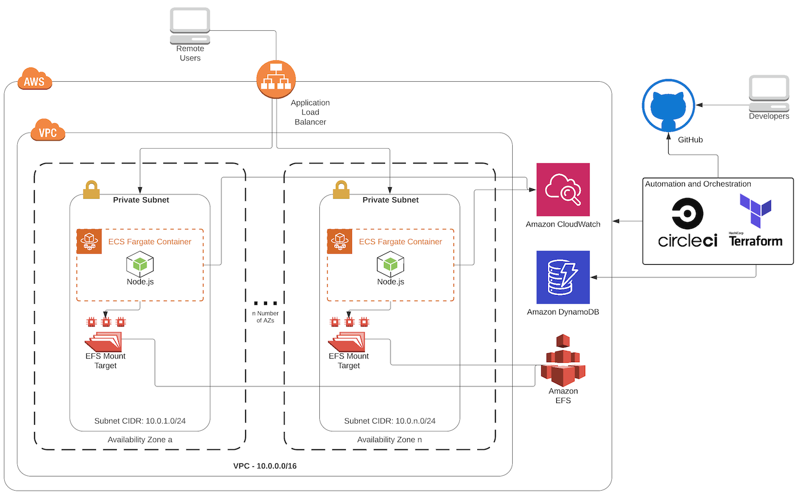
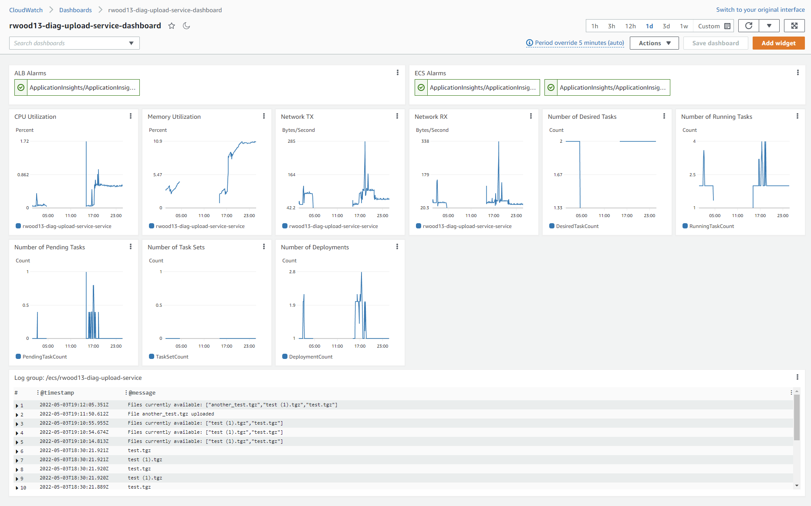
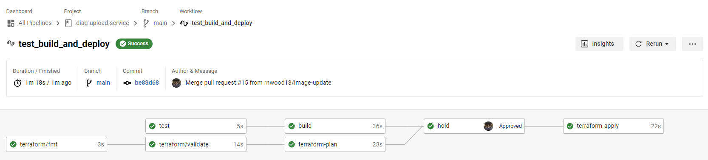

# Diagnostics Upload Service 
The Diagnostics Upload Service is a serverless cloud application designed for users to upload `*.tgz` diagnostics files for a support team to review.  
It utilizes several features of [AWS Cloud](https://aws.amazon.com/) for infrastructure and hosting and [CircleCI](https://circleci.com/) for automation and orchestration.  
This application uses Node.js with the Express.js web framework running on ECS Fargate.  
The app was designed with high availability, scalability, and observability in mind and developed with "Everything as Code."

## Getting Started

### Requirements

- An AWS account
- An AWS IAM user or role with programmatic access and proper permissions
- A CircleCI account with a context that includes the AWS programmatic user

### Deploy

- Copy or fork this repository and modify how you see fit (for instance, change the basic auth username and password)  
- Go to the [CircleCI application](https://app.circleci.com/) and link the new repo   
- Run the pipeline and approve the manual HOLD step  
- Copy the Terraform `alb_url` output from the `terraform-apply` job into a browser to access the application  
- NOTE: You may need to deploy Terraform locally with a local state file first (see Development section below and read notes in `terraform/backend.tf`)

### Usage

The following examples include only the path - add the path after the domain.

- `/` : The main page with a form for diagnostics files to be uploaded
- `/upload` : Submit a multi-part upload - will usually be accessed via the main page form
- `/download/<filename>` : Download a specific file - replace <filename> with the name of the file
- `/files` : Get a list of files that are available to download

<p align="right">(<a href="#top">back to top</a>)</p>

## Architecture



<p align="right">(<a href="#top">back to top</a>)</p>

## Design Decisions

This section covers the thought process behind the development of this application, as well as various features of the app.  
While planning, I went back and forth between ECS Fargate and EKS (which I have more experience with) but I chose ECS as it is lighter weight and requires less maintenance.  

### High Availability and Scalability

The application was designed with high availability in mind.  

- The ECS Cluster runs a service with two tasks (autoscaling is discussed in Future Improvements section)
- The ECS Cluster is behind a non-sticky load balancer so it doesn't care which container it hits, or how many it is balancing
- Each container connects to an EFS instance so that all containers have access to the diagnostics files at all times
- A new app build updates the task definition's image, which is then rolled out by ECS which performs health checks

### Observability

I had originally planned to go with EKS with Prometheus and Grafana, but decided it was too labor-intensive for this project.  
Instead, the app utilizes AWS CloudWatch by sending metrics and logs, which then populates a dashboard as a single pane of glass to observe the health of the ECS cluster.  



### Automation & Orchestration

This project utilizes CircleCI as the CI/CD vendor, mainly as I have experience with it.  
The workflow is this:

1. A developer pushes branch code to GitHub
2. CircleCI picks up the change and runs Nodes tests and build, and Terraform fmt and plan
3. A developer creates and merges a Pull Request
4. CircleCI picks up the change and runs the test, build, fmt, plan and then waits via manual "Hold" action
5. Developer reviews the changes and approves the Hold
6. The CircleCI pipeline continues by doing a Terraform apply, which updates the ECS application using the image build from step 4



See the public CircleCI pipeline connected to this repository for details.

### Security

Security should always be considered a first-class citizen, so here are the security considerations taken for this application.  
Please see Future Improvements for planned security improvements.  

- Only the ALB is accessible publicly
- Each container runs in a private subnet
- There is a Security Group on the ALB only allowing port 80 (see Future Improvements for HTTPS/443 information)
- There is a Security Group on the ECS tasks that only allow the ALB SG as a source
- There is a Security Group on the EFS instance that only allows the ECS SG as a source
- ECS utilizes transit encryption to EFS
- Terraform state files are encrypted in S3 with DyanamoDB locking
- The application uses basic authentication in the Node app by using `express-basic-auth` (currently set to admin/admin so be sure to change before deploying, or better yet, use a more secure auth mechanism)

### Reliability and Testing

There are Node.js unit tests for the application using mocha and chai which tests that the application is production-ready.  
These include tests for each API endpoint ('/', '/upload', '/download/:id', '/files') as well as tests for basic auth.  
See the `test/` directory for more information.

<p align="right">(<a href="#top">back to top</a>)</p>

## Future Improvements

The speed at which this application was developed means that some things unable to be fleshed out entirely.  
This section aims to call out these areas which can (and should) be implemented in the near future.  

- The most obvious improvement is utilizing HTTPS port 443 on the ALB. This is not difficult to do, but requires the purchase of a domain name. If given more time, I would implement Route53 with ACM certificate validation, and use that ACM certificate on the ALB, while redirecting HTTP port 80 traffic to HTTPS 443
- Use Route53 domain instead of ALB DNS address (see improvement note above)
- Use ECS Autoscaling based on CPU utilization, memory utilization, or ALB requests
- Use multiple environments for testing or staging before moving to production
- Improve auth security by moving away from basic auth and using something like API Gateway or SSO
- Restrict downloads by authentication role so only those with proper permissions can download the diagnostics files
- Alerting via SNS when an alarm is triggered
- Alerting via SNS whenever a diagnostics file is uploaded
- Restrict uploads to only `*.tgz` filetypes 
- Add nicer HTML and CSS
- Provide a better downloads/files page with a list of files and button to download
- Make app support concurrent requests with async

<p align="right">(<a href="#top">back to top</a>)</p>

## Development

To develop and test locally:

### Requirements

- Node.js and NPM installed
- (Optional) An AWS account
- (Optional) An AWS IAM user or role with programmatic access and proper permissions
- (Optional) Terraform installed (recommended to use [tfenv](https://github.com/tfutils/tfenv) for versioning)

### Running the Application

The app is in the `app/` directory and there is a diag directory in `/app/diags/` for local testing.  
To run the application locally, navigate to the repo directory and then via CLI:

```
npm install
node app/index.js
```

Go to a browser at `http://localhost:8000` to upload and download diagnostics files.  

### Deploying Terraform

Navigate to the `terraform/` directory and, optionally, update the `TF_VAR_ecr_image_tag` variable to customize the image deployed:

```
export TF_VAR_ecr_image_tag=my-tag
terraform apply
```

<p align="right">(<a href="#top">back to top</a>)</p>
